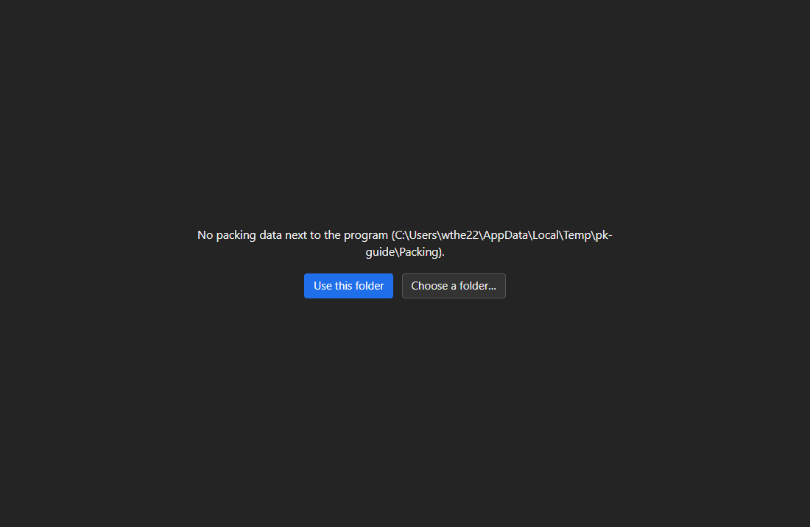
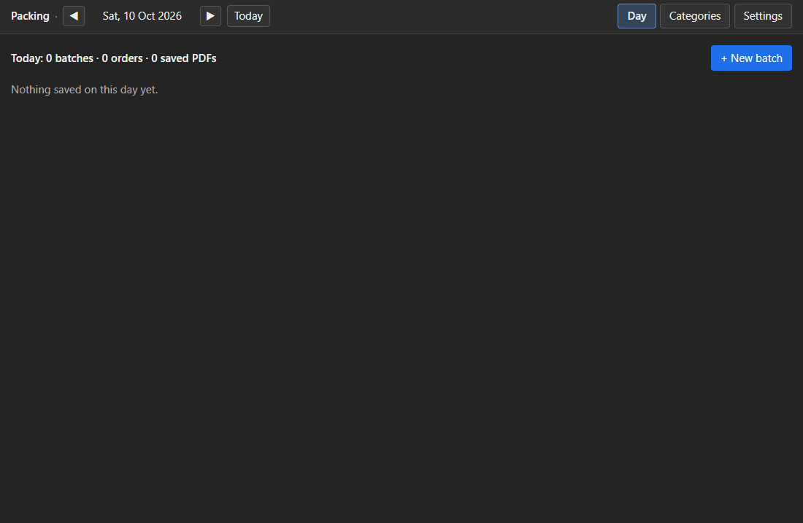
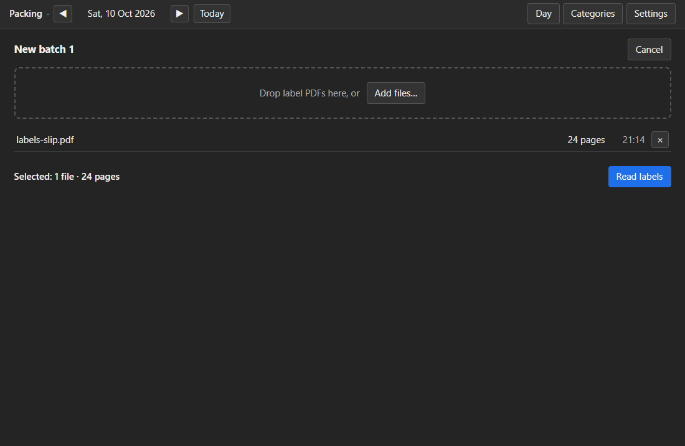
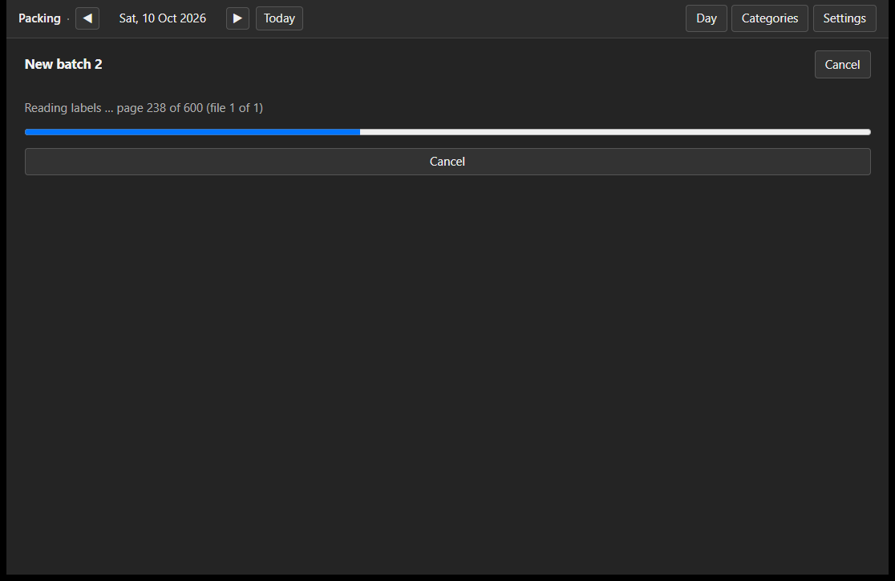
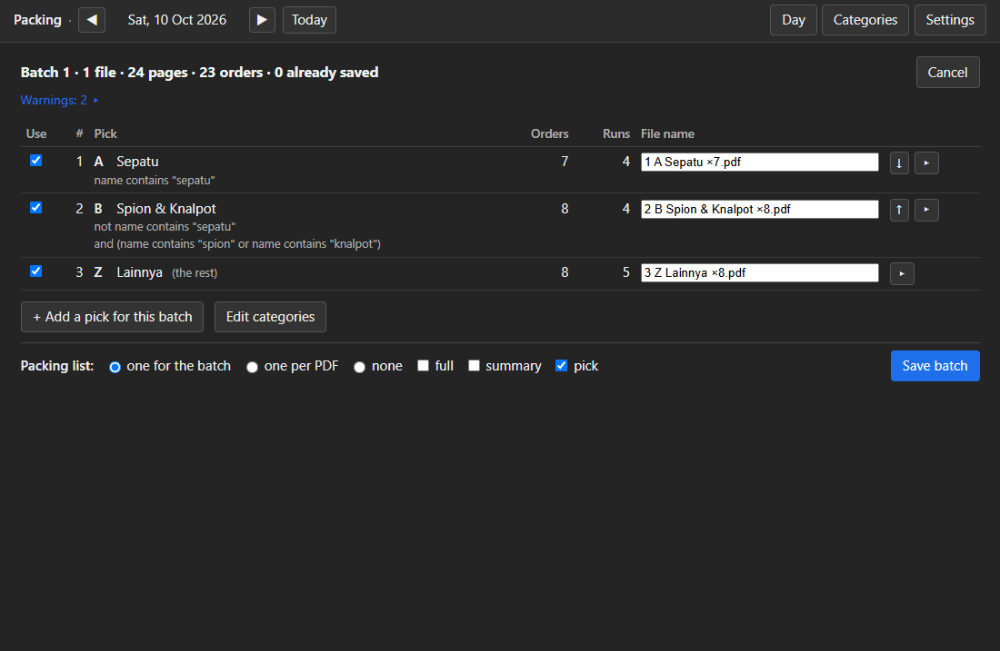
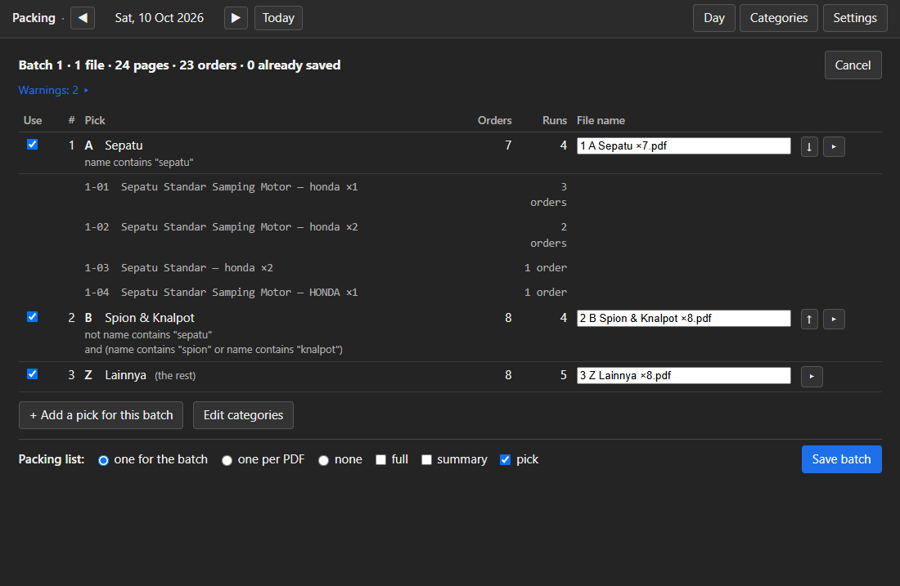
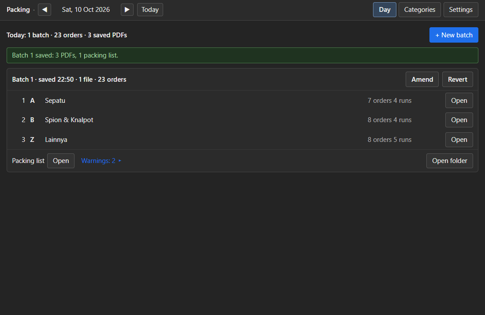
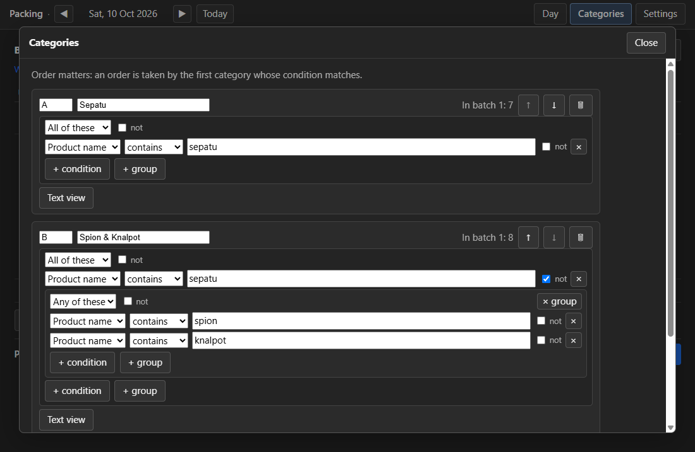

# 01 — The PC app **Packing**: how to use it

For the shop owner. This guide shows how to put the program on a Windows PC and how to do the
daily work — bring in the label downloads, check the picks, save and print. No terminal is needed.

The pictures are in [`images/`](images/) and were made with the made-up `testdata/` labels, so no
real order data appears.

## 1. Set up the program folder

The app is one folder, not an installed program.

1. Copy the folder `Packing` (the output of `pc/tools/make-portable.sh`, or the folder you were
   given) to a place you can write to, for example `D:\Packing\`. **Do not** put it under
   `C:\Program Files` — Windows does not let the app write there.
2. The folder must contain both files:
   - `Packing.exe` — the program;
   - `pdfium.dll` — the PDF reader the program uses; it does not work without it.
3. Make a shortcut to `Packing.exe` on the Desktop or the taskbar: right-click `Packing.exe` →
   *Show more options* → *Send to* → *Desktop (create shortcut)*. Start the program from the
   shortcut.

The app keeps its data in the same folder (see below). Copying the whole folder to another PC
moves the program and all its data along.

## 2. The first start

When the program starts and finds no data next to it, it says
**"No packing data next to the program (`D:\Packing\`)."** and offers two buttons:

- **Use this folder** — the app writes its `categories.toml` (your list of picks) next to the
  program and uses this folder from now on. Choose this for a normal setup.
- **Choose a folder…** — pick another folder for the data. It is used only until you close the
  app; the next start asks again. Use this when the program folder cannot be written.

After that the **Day** screen opens.

## 3. A new version of the program

When you get a new version, close the app, then copy the new `Packing.exe` and `pdfium.dll` over
the old ones in the program folder. Your data (`categories.toml`, `settings.json`, the `labels`
folder) stays as it is.

## 4. A normal batch, step by step

A batch is one round of the day: you download the labels in the seller centre, prepare them in the
app, then print.

### The Day screen

The **Day** screen shows what has been saved today and is the way to the next batch.

- The top line counts today: "Today: 2 batches · 729 orders · 5 saved PDFs".
- **+ New batch** starts a new batch.
- Each batch is a card: "Batch 1 · saved 07:40 · 3 files · 600 orders", with one line per saved
  PDF (number, pick code and name, orders, runs) and **Open** to open it in your PDF viewer.
- **Open folder** opens the batch folder in Explorer.
- On the newest batch only: **Amend** and **Revert** (see §6).
- A day with nothing saved shows "Nothing saved on this day yet."

The date in the top bar is the day everything is saved to. ◀ ▶ step a day; **Today** goes back to
today (handy for a download just after midnight).

### New batch

1. Click **+ New batch**.
2. Add the label files: click **Add files…** and choose the *Shipping label + Packing slip* PDFs
   of this download, or drop them onto the window ("Drop label PDFs here, or Add files…").
   - Each file shows its page count and time. A file already used earlier today shows
     *used in batch n* in orange.
   - **×** removes a file from the list.
3. Click **Read labels**.

### Reading

The app reads the files page by page: "Reading labels …  page 143 of 257 (file 1 of 2)" with a
progress bar. **Cancel** stops and returns to the file list; nothing is written. When it is done
the **Plan** screen opens.

### Plan

The Plan screen is the heart of the app: which orders go into which saved PDF. It opens with your
categories applied in order.

- The header: "Batch 3 · 2 files · 257 pages · 256 orders · 0 already saved".
- **Rows** are the picks in order. Each takes its orders from the rows above.
- **Use** (the tick) turns a pick off for this batch only; its orders fall to the rows below. The
  rules file is not changed.
- **↑ ↓** move a pick. **▸** shows the runs of a pick — what the packing list will show:

- **File name**: the suggested name is `<n> <code> <name> ×<orders>`; you can change the whole
  name. Two saved PDFs of one batch cannot have the same name (the second shows "Same name as
  PDF 6").
- **+ Add a pick for this batch** adds a one-off pick (it is not saved to your categories).
- **Edit categories** opens your categories (see §7).
- **Packing list**: choose *one per PDF*, *one for the batch* (default) or *none*, and the layouts
  *full*, *summary*, *pick* (default *pick*).
- **Save batch** writes everything and returns to the Day screen. **Cancel** asks
  "Discard batch 3? Nothing has been saved."

### After saving

The Day screen shows the new batch on top with a green line "Batch 3 saved: 3 PDFs, 1 packing
list." Click **Open** on each saved PDF and on the packing list, and print them.

Everything is written into the program folder under `labels\<day>\batch <n>\`: the saved PDFs, the
packing list, a `summary.txt`, and a `download\` copy of the files you read (so Amend works even if
the originals are gone).

## 5. Several batches a day

Do the same for each download. The saved-PDF numbers continue through the day (batch 2 starts
after batch 1's last number), so "sort by name" inside a batch folder is printing order. A file
you read in an earlier batch today is marked *used in batch n*; if you read it again, its orders
are found as already saved and left out (a warning lists them).

## 6. Revert and amend the last batch

Only the newest batch can be changed — later batches depend on it.

- **Revert** — undo the last batch. It asks:
  "Undo batch 2? Its 2 saved PDFs, packing list and download copies are deleted, and its 129
  orders can be saved again. If you already printed them, throw the printed labels away."
  [Cancel] [Undo batch 2]. The orders count as not saved again and the next batch reuses the
  numbers. If a file is open in a PDF viewer, the app says which file to close and changes
  nothing.
- **Amend** — "I fixed a category, do the last batch again". It asks:
  "Redo batch 2 with the current categories? Batch 2 was saved at 09:12. If you already printed
  it, print it again after saving." [Cancel] [Redo batch 2]. The Plan screen opens again (titled
  *Redo batch 2*, button *Save batch 2 again*); **Save** replaces the old batch, **Cancel** leaves
  it as it was.

## 7. Editing your categories

Open **Categories** (in the top bar, or **Edit categories** on the Plan screen). Categories are
your picks, in order: an order is taken by the first category whose condition matches. The last
category has no condition and takes the rest.

- Each category has a **code**, a **name** and a condition. The condition is built from boxes: a
  group is **All of these** (*and*) or **Any of these** (*or*) and holds rows of
  *field · operator · value*; **not** reverses a row or a group.
- **Text view** switches one category to typing the condition as text; **Boxes** switches back.
  **Edit file as text** shows the whole file. **Help: examples ▸** lists examples.
- **Save** writes the file; **Cancel** leaves it unchanged. Your comments are kept.

Four example conditions (more in [04-rules-file.md](../software-design/04-rules-file.md)):

| You want | Condition |
|---|---|
| everything with "sepatu" in the product name | `name contains "sepatu"` |
| orders of 3 items or more | `total_quantity >= 3` |
| everything sent by J&T | `courier starts_with "J&T"` |
| spion or knalpot, but not sepatu | `not name contains "sepatu" and (name contains "spion" or name contains "knalpot")` |

## 8. Every message and what to do

**Stop** messages end the batch and write nothing. **Warnings** are listed (click **Warnings ▸**);
the batch can still be saved.

| Message | What to do |
|---|---|
| **These labels have no packing slip.** `<n>` of `<m>` pages are plain shipping labels (`<file>`, pages `<list>`). | You downloaded plain labels. In the seller centre, download again with **Shipping label + Packing slip**. |
| **`<file>`: page `
` has no Order ID** | The file does not look like a TikTok Shop label download (or is damaged). Remove it and use the right file. |
| **`<file>` cannot be read as a PDF.** It may be damaged or still downloading. Download it again. | Download the file again, then add it. |
| **`<line, col: message>`** — a category error, e.g. `line 18, col 8: field "product_category" needs the orders CSV, which the PC app does not read` | Fix the condition in Categories (the app opens it for you). |
| **All `<n>` orders were already saved today** (batch `<b>`). These labels were prepared before; nothing to do. | These labels were done in an earlier batch today. Nothing to do. |
| **`<n>` orders were already saved today** and are left out: `<tracking ID>` (batch `<b>`, PDF `<k>`, `<time>`), … | A warning: those orders are skipped. Remove the file if you did not mean to read it again. |
| **no courier could be deduced for:** `<order IDs>` | A warning: those orders are sorted normally; only a category that uses `courier` cannot see them. Check those labels by eye if you use one. |
| **`<order ID>`: Qty Total `<a>` differs from the sum of Qty `<b>`** | A warning: check that order's packing slip when you pack it. |
| **no tracking ID for:** `<order IDs>` | A warning: those labels are saved as usual; only a category that uses `tracking_id` cannot see them. |
| **`<file>` is open in another program.** Close it (e.g. the PDF viewer) and press Save again. | Close the PDF viewer, then press **Save batch** again. |
| **Cannot write to `<folder>`:** `<reason>`. Nothing was saved. | Check the disk is not full and the folder is writable, then save again. |

## 9. Settings

Open **Settings** in the top bar.

- **Data folder** — where `categories.toml` and the `labels` folder live. **Change…** switches to
  another folder until the app closes ("Use `<folder>` until the app closes? Existing days stay in
  `<old>`."); **Open** opens it. It does not move existing files.
- **Packing list default** — the scope and layouts the Plan screen starts with (default: one for
  the batch, layout *pick*). **Save** stores it.
- **About** — the version and the PDFium version.

The app is in English. Every screen text is in one file, so another language can be added later.
